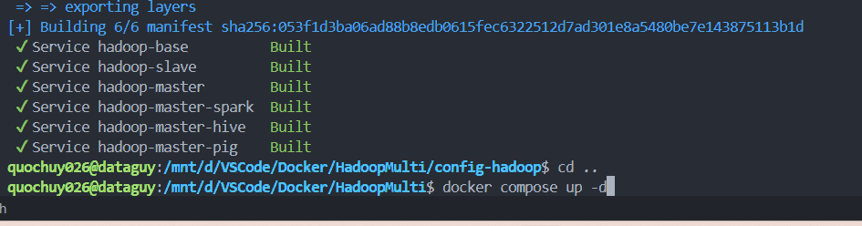
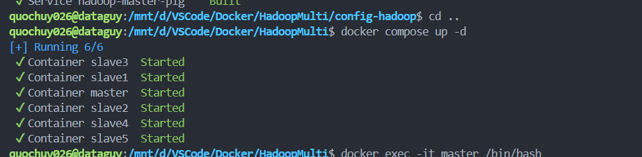
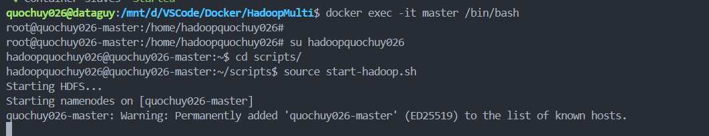
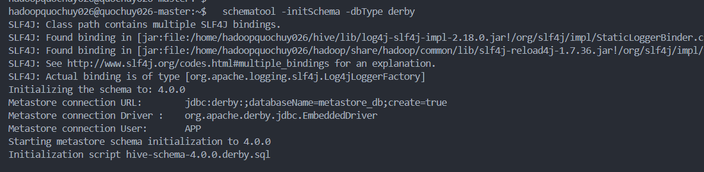
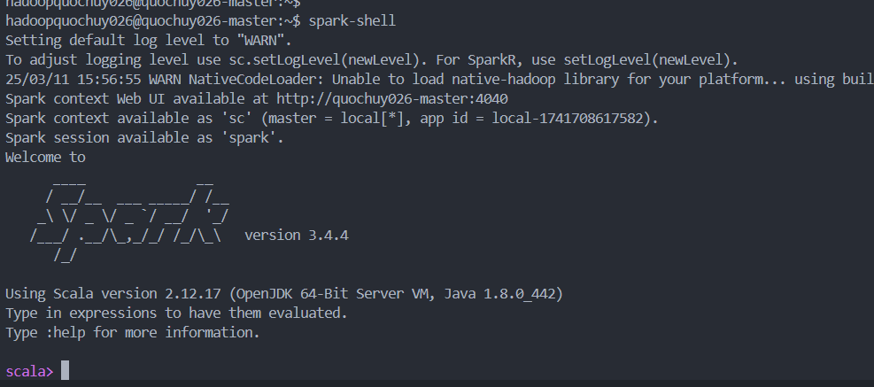
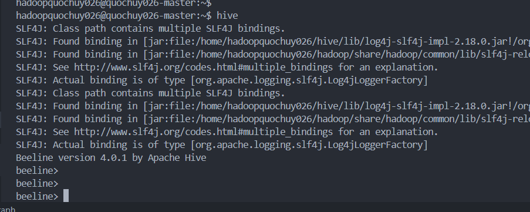
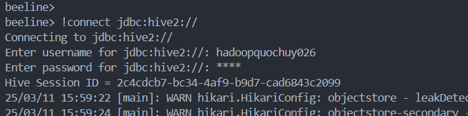
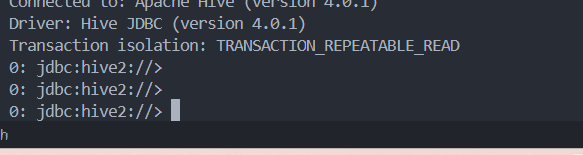
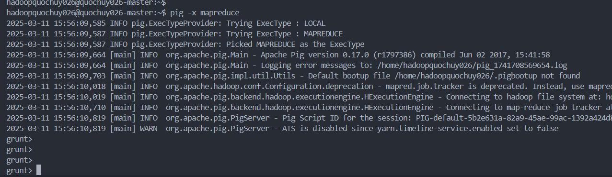

# 🚀 Hadoop Cluster Setup with Spark, Hive, and Pig  

## 1️⃣ Start Docker 🐳  
- Open **Docker Desktop** (if not already running).  

## 2️⃣ Rename User 🔄  
- Open **WSL2**.  
- Navigate to the project folder:  
  ```bash
  cd HaMu
  ```
- Run the rename script:  
  ```bash
  python rename-owner.py
  ```
- Enter your new username (e.g., `hadoophuydeptrai`).  

## 3️⃣ Build Docker Images 🏷️  
- Move to the Hadoop config directory:  
  ```bash
  cd HaMu/config-hadoop
  ```
- Build the images:  
  ```bash
  docker compose build
  ```
  

## 4️⃣ Start Containers 🚀  
- Return to the main directory:  
  ```bash
  cd ..
  ```
- Start all containers:  
  ```bash
  docker compose up -d
  ```
  
  

## 5️⃣ Access the Master Container ⛓️  
  ```bash
  docker exec -it master /bin/bash
  ```
  
## 6️⃣ Activate Hive 🐝  
  ```bash
  schematool -initSchema -dbType derby
  ```
  






💪 Now you can use your Hadoop Cluster with Spark, Hive, and Pig! 🎉  

🔹 **Thank you for using this setup!** 😃

